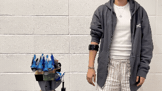

# ReactEMG: Zero-Shot, Low-Latency Intent Detection via sEMG

[Project Page](https://reactemg.github.io/) | [arXiv](https://arxiv.org/abs/2506.19815) | [Video](https://youtu.be/AKT8hMvVCGY)

[Runsheng Wang](http://runshengwang.com/)<sup>1</sup>,
[Xinyue Zhu](https://xinyuezhu.com/)<sup>1</sup>,
[Ava Chen](https://avachen.net/),
[Jingxi Xu](https://jxu.ai/),
[Lauren Winterbottom](https://reactemg.github.io/),
[Dawn M. Nilsen](https://www.vagelos.columbia.edu/profile/dawn-nilsen-edd)<sup>2</sup>,
[Joel Stein](https://www.neurology.columbia.edu/profile/joel-stein-m-d)<sup>2</sup>,
[Matei Ciocarlie](https://www.me.columbia.edu/faculty/matei-ciocarlie)<sup>2</sup>

<sup>1</sup>Equal contribution,
<sup>2</sup>Co-Principal Investigators

Columbia University

<div style="margin:50px; text-align: justify;">


ReactEMG is a zero-shot, low-latency EMG framework that segments forearm signals in real time to predict hand gestures at every timestep, delivering calibration-free, high-accuracy intent detection ideal for controlling prosthetic and robotic devices.

## :package: Installation
Clone the repo with `--recurse-submodules` and install our conda (mamba) environment on an Ubuntu machine with a NVIDIA GPU. We use Ubuntu 24.04 LTS and Python 3.11. 

```bash
mamba env create -f environment.yml
```

Install [PyTorch](<https://pytorch.org/get-started/locally/>) in the conda environment, then install wandb via pip:

```bash
pip install wandb
```

Lastly, install minLoRA via:

```bash
cd minLoRA && pip install -e .
```

minLorRA was built for editable install with `setup.py develop`, which is deprecated. Consider enabling `--use-pep517` and use `setuptools ≥ 64` when working with `pip ≥ 25.3`.

## :floppy_disk: Datasets

### 1. ROAM-EMG 
We are open-sourcing our sEMG dataset, **ROAM-EMG**.  
- **Scope:** Using the Thalmic Myo armband, we recorded eight-channel sEMG signals from 28 participants as they performed hand gestures in four arm postures, followed by two grasping tasks and three types of arm movement. Full details of the dataset are provided in our paper and its supplementary materials.
- **Download:** [Dropbox Link](<https://www.dropbox.com/scl/fi/19zvl12vn27wsnzsmw0vx/ROAM_EMG.zip?rlkey=x6gtygdfz24i8efdswr1exii7&st=ljzuoire&dl=0>)  

### 2. Pre-processed public datasets  
For full reproducibility, we also provide pre-processed versions of all public EMG dataset used in the paper. The file structures and data formats have been aligned with ROAM-EMG. We recommend organizing all datasets under the `data/` folder (automatically created with the command below) in the root directory of the repo. To download all datasets (including ROAM-EMG): 

```bash
curl -L -o data.zip "https://www.dropbox.com/scl/fi/isj4450alriqjfstkna2s/data.zip?rlkey=n5sf910lopskewzyae0vgn6j7&st=vt89hfpj&dl=1" && unzip data.zip && rm data.zip
```

## :hammer_and_wrench: Training

### Logging

We use W&B to track experiments. Decide whether you want metrics online or offline:

```bash
# online (default) – set once in your shell
export WANDB_PROJECT=my-emg-project
export WANDB_ENTITY=<your-wandb-username>

# or completely disable
export WANDB_MODE=disabled
```

### Pre-training with public datasets

Pre-train the any2any (ReactEMG) model on EMG-EPN-612 and the other public datasets (3-class):

```bash
bash scripts/roam_emg_1_pretrain.sh
```

This wraps `main.py` with the paper's pre-training configuration and saves checkpoints to `model_checkpoints/any2any_pretrain_3class_<timestamp>_<machine_name>/epoch_<N>.pth`, where `<timestamp>` records the run's start time and `<machine_name>` identifies the host. Ensure you have write permission where you launch the job. The three `scripts/roam_emg_*.sh` scripts form the end-to-end ROAM-EMG pipeline — pre-train (step 1), fine-tune (step 2), evaluate (step 3) — for the main method; run them in order.

To reproduce the baselines (ANN, LSTM, ED-TCN, TraHGR, LDA) alongside any2any, use `scripts/pretrain_all_3class.sh` instead. To train EPN-only models for evaluation purposes, use `scripts/train_all_epn_3class.sh` (or `scripts/train_all_epn_6class.sh`). Every script is a thin wrapper over `main.py` — open it to see or adjust the exact flags (e.g. add `--saved_checkpoint_pth path/to/epoch_X.pth` to initialize from a checkpoint, or `--use_lora 1` to fine-tune via LoRA).

### Fine-tuning on ROAM-EMG

Fine-tuning follows a leave-one-subject-out (LOSO) protocol: a separate model is trained for each of the 28 subjects in ROAM-EMG, holding that subject out for validation.

```bash
bash scripts/roam_emg_2_finetune.sh
```

By default this fine-tunes from the most recent pre-training run of step 1 (its `epoch_11.pth`). To start from a specific checkpoint instead, set `PRETRAIN_CKPT`:

```bash
PRETRAIN_CKPT=model_checkpoints/any2any_pretrain_3class_<stamp>_<host>/epoch_11.pth \
  bash scripts/roam_emg_2_finetune.sh
```

To fine-tune the baselines as well, use `scripts/finetune_all_loso.sh` (fill in the per-architecture checkpoint paths at the top).

## :bar_chart: Evaluation

We evaluate model performance on two metrics:
- **Raw accuracy**: Per-timestep correctness across the entire EMG recording
- **Transition accuracy**: Event-level score that captures accuracy and stability

During evaluation, we run the model exactly as how it would run online: windows slide forward in real time and predictions are aggregated live. This gives a realistic view of online performance instead of an offline, hindsight-only score.

### Run the evaluation
```bash
bash scripts/roam_emg_3_eval.sh
```

This auto-discovers the 28 LOSO checkpoints from the previous step and evaluates them, reporting the per-subject mean ± std of transition and raw accuracy. any2any is evaluated twice: once with no smoothing (*no lookahead*) and once with the paper's online smoothing — a 50-sample future majority vote (*lookahead 50*).

To evaluate the baselines as well, use `scripts/eval_all_loso.sh`. To evaluate EPN-only models, use `scripts/eval_all_epn_3class.sh` (or `scripts/eval_all_epn_6class.sh`); fill in the checkpoint paths at the top of those scripts.

### Output

Evaluation writes everything under `output/`, at two levels.

**Aggregated** — one `.txt`/`.json` pair per model and smoothing config, written by `eval_runner.py`:
- `batch_eval_summary_any2any_LA0_<timestamp>.{txt,json}` (no lookahead) and `batch_eval_summary_any2any_LA50_<timestamp>.{txt,json}` (lookahead 50). Each contains the overall transition & raw accuracy (per-subject mean ± std), a per-subject accuracy table, and aggregated + per-subject failure-reason breakdowns. The `.json` mirrors the `.txt` for programmatic access.

**Per-subject** — one folder per checkpoint and smoothing config, written by `event_classification.py`:
`output/any2any_LOSO_<sN>_<stamp>_<host>_epoch_4_LA<lookahead>/`, each holding:
- `evaluation_summary_*.txt`: that subject's transition & raw accuracy and a tally of transition reasons.
- `evaluation_details_*.json`: per-file metrics plus the full ground-truth and prediction sequences.
- `plots/*.png`: a 3-panel figure per recording — 8-channel EMG, ground-truth labels, and model predictions over time.

## :memo: Citation
If you find this codebase useful, consider citing:

```bibtex
@misc{https://doi.org/10.48550/arxiv.2506.19815,
  doi = {10.48550/ARXIV.2506.19815},
  url = {https://arxiv.org/abs/2506.19815},
  author = {Wang,  Runsheng and Zhu,  Xinyue and Chen,  Ava and Xu,  Jingxi and Winterbottom,  Lauren and Nilsen,  Dawn M. and Stein,  Joel and Ciocarlie,  Matei},
  keywords = {Robotics (cs.RO),  FOS: Computer and information sciences,  FOS: Computer and information sciences},
  title = {ReactEMG: Zero-Shot,  Low-Latency Intent Detection via sEMG},
  publisher = {arXiv},
  year = {2025},
  copyright = {Creative Commons Attribution 4.0 International}
}
```

## :email: Contact
For questions or support, please email Runsheng at runsheng.w@columbia.edu

## :scroll: License
This project is released under the MIT License; see the [License](LICENSE) file for full details.

## :handshake: Acknowledgments
This work was supported in part by an Amazon Research Award and the Columbia University Data Science Institute Seed Program. Ava Chen was supported by NIH grant 1F31HD111301-01A1. The views and conclusions contained herein are those of the authors and should not be interpreted as necessarily representing the official policies, either expressed or implied, of the sponsors. We would like to thank Katelyn Lee, Eugene Sohn, Do-Gon Kim, and Dilara Baysal for their assistance with the hand orthosis hardware. We thank Zhanpeng He and Gagan Khandate for their helpful feedback and insightful discussions.

